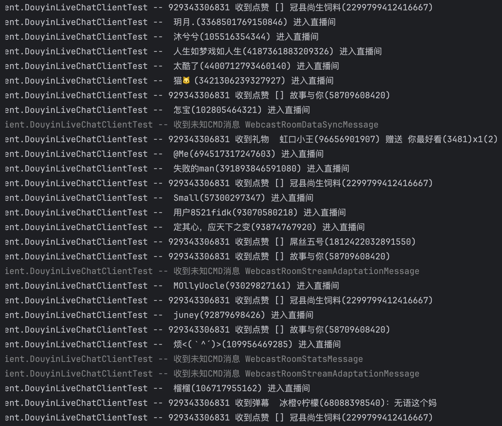

# ordinaryroad-live-chat-client

  

> This project is in progress... 👨‍💻，有问题欢迎[提交issuse](https://github.com/OrdinaryRoad-Project/ordinaryroad-live-chat-client/issues/new/choose)，
> 觉得有用的话可以点个小星星⭐️鼓励一下，感谢
>
> 如果对项目感兴趣也欢迎[加入QQ频道](https://pd.qq.com/s/3id0n7fvs)交流讨论，
> 提交PR
>
> ToDo List: https://github.com/orgs/OrdinaryRoad-Project/projects/1

---

Live room WebSocket chat client

- Feature 0: Netty
- Feature 1: 消息中的未知属性统一放到单独的MAP中
- Feature 2: 支持自动重连
- Feature 3: 支持同时监听多个直播间
- Feature 4: 支持短直播间id
- Feature 5: 支持弹幕发送、为主播点赞*
- Feature 6: 内置收到弹幕、收到礼物、收到醒目留言、用户入房、收到点赞回调*

> *存在平台差异
> - ✅: 平台支持且已完成
> - ☑️️: 平台支持但未实现
> - ❌: 平台暂不支持

平台适配情况表

| 平台          | LiveChatClient | Cookie | 短直播间id | 发送弹幕 | 为主播点赞 |
|-------------|----------------|--------|--------|------|-------|
| Bilibili B站 | ✅              | ✅      | ✅      | ✅    | ✅     | ✅ |
| Douyu 斗鱼    | ✅              | ✅      | ✅      | ✅    | ❌     |
| Huya 虎牙     | ✅              | ✅      | ✅      | ✅    | ❌     |
| Douyin 抖音   | ✅              | ☑️️    | ✅      | ☑️   | ☑️️   |
| Kuaishou 快手 | ✅              | ✅      | ✅      | ✅    | ✅     |

平台直播间消息适配情况表

| 平台          | 弹幕 | 礼物        | 醒目留言 | 进入房间    | 点赞      |
|-------------|----|-----------|------|---------|---------|
| Bilibili B站 | ✅  | ✅         | ✅    | ✅       | ✅       |
| Douyu 斗鱼    | ✅  | ✅         | ☑️   | ✅       | ❌       |
| Huya 虎牙     | ✅  | ✅         | ❌    | ✅（高级用户） | ❌       |
| Douyin 抖音   | ✅  | ✅         | ❌    | ✅       | ✅（点赞个数） |
| Kuaishou 快手 | ✅  | ✅（礼物信息不全） | ❌    | ❌       | ✅       |

消息接口内置的方法见 [https://github.com/OrdinaryRoad-Project/ordinaryroad-live-chat-client/tree/main/live-chat-client-commons/live-chat-client-commons-base/src/main/java/tech/ordinaryroad/live/chat/client/commons/base/msg](https://github.com/OrdinaryRoad-Project/ordinaryroad-live-chat-client/tree/main/live-chat-client-commons/live-chat-client-commons-base/src/main/java/tech/ordinaryroad/live/chat/client/commons/base/msg)

运行效果图


---

[//]: # ([在线文档]&#40;https://ordinaryroad.tech/or_module/live-chat-client/&#41;)

## [⭐BarrageFly——让弹幕飞](https://barragefly.ordinaryroad.tech/)，基于该项目的一个弹幕转发、过滤、处理平台

## 0 原理

直接人工抓取浏览器的WebSocket二进制流，然后分析模拟浏览器的行为；这样做的好处是不需要进行开发者认证，代价就是没有官方文档，分析过程比较费时费力，并且需要适配不同平台的流程变化（一般不会有大变化）

以后可能会考虑支持平台的开放协议

## 1 安装

> JDK ≥ 8

### B站

```xml

<dependency>
    <groupId>tech.ordinaryroad</groupId>
    <artifactId>live-chat-client-bilibili</artifactId>
    <!-- 参考github release版本，不需要前缀`v` -->
    <version>${ordinaryroad-live-chat-client.version}</version>
</dependency>
```  

### 斗鱼

```xml

<dependency>
    <groupId>tech.ordinaryroad</groupId>
    <artifactId>live-chat-client-douyu</artifactId>
    <!-- 参考github release版本，不需要前缀`v` -->
    <version>${ordinaryroad-live-chat-client.version}</version>
</dependency>
```

### 虎牙

```xml

<dependency>
    <groupId>tech.ordinaryroad</groupId>
    <artifactId>live-chat-client-huya</artifactId>
    <!-- 参考github release版本，不需要前缀`v` -->
    <version>${ordinaryroad-live-chat-client.version}</version>
</dependency>
```

### 抖音

```xml

<dependency>
    <groupId>tech.ordinaryroad</groupId>
    <artifactId>live-chat-client-douyin</artifactId>
    <!-- 参考github release版本，不需要前缀`v` -->
    <version>${ordinaryroad-live-chat-client.version}</version>
</dependency>
```

### 快手

```xml

<dependency>
    <groupId>tech.ordinaryroad</groupId>
    <artifactId>live-chat-client-kuaishou</artifactId>
    <!-- 参考github release版本，不需要前缀`v` -->
    <version>${ordinaryroad-live-chat-client.version}</version>
</dependency>
```

## 2 使用

> 测试类包含了多种样例，可供参考

### 2.0 不同平台的CMD定义

- B站：[BilibiliCmdEnum](https://github.com/OrdinaryRoad-Project/ordinaryroad-live-chat-client/blob/main/live-chat-clients/live-chat-client-bilibili/src/main/java/tech/ordinaryroad/live/chat/client/bilibili/constant/BilibiliCmdEnum.java)
- 斗鱼：[DouyuCmdEnum](https://github.com/OrdinaryRoad-Project/ordinaryroad-live-chat-client/blob/main/live-chat-clients/live-chat-client-douyu/src/main/java/tech/ordinaryroad/live/chat/client/douyu/constant/DouyuCmdEnum.java)
- 虎牙：[HuyaCmdEnum](https://github.com/OrdinaryRoad-Project/ordinaryroad-live-chat-client/blob/main/live-chat-clients/live-chat-client-huya/src/main/java/tech/ordinaryroad/live/chat/client/huya/constant/HuyaCmdEnum.java)
- 抖音：[DouyinCmdEnum](https://github.com/OrdinaryRoad-Project/ordinaryroad-live-chat-client/blob/main/live-chat-clients/live-chat-client-douyin/src/main/java/tech/ordinaryroad/live/chat/client/douyin/constant/DouyinCmdEnum.java)
- 快手：[PayloadTypeOuterClass](https://github.com/OrdinaryRoad-Project/ordinaryroad-live-chat-client/blob/main/live-chat-clients/live-chat-client-kuaishou/src/main/java/tech/ordinaryroad/live/chat/client/kuaishou/protobuf/PayloadTypeOuterClass.java)

可以重写`onCmdMsg(收到的所有CMD消息)`或`onOtherCmdMsg(框架未处理的CMD消息)`回调方法，判断CMD来监听框架已经定义的CMD类型

如果要监听的消息枚举类中未定义，可以考虑重写`onUnknownCmdMsg(未知CMD消息)`方法，并修改消息回调接口的函数签名

```java
@Override
public void onOtherCmdMsg(BilibiliCmdEnum cmd, ICmdMsg<BilibiliCmdEnum> cmdMsg) {
        switch (cmd) {
            case GUARD_BUY -> {
                // 有人上舰
                SendSmsReplyMsg sendSmsReplyMsg = (SendSmsReplyMsg) cmdMsg;
                ...
            }
            case SUPER_CHAT_MESSAGE_DELETE -> {
                // 删除醒目留言
                SendSmsReplyMsg sendSmsReplyMsg = (SendSmsReplyMsg) cmdMsg;
                ...
            }
        }
}
```

### 2.1 Client模式

> Spring Boot 示例 [client-example](https://github.com/OrdinaryRoad-Project/ordinaryroad-live-chat-client/tree/main/live-chat-client-examples/client-example)

1. 创建配置
2. 创建Client并传入配置、添加消息回调
3. 开始监听直播间

> 如果需要查看其他平台的效果，请将`Bilibili`改为其他平台对应的英文

```java
public class ClientModeExample {
    public static void main(String[] args) {
        String cookie = System.getenv("cookie");
        // 1. 创建配置
        BilibiliLiveChatClientConfig config = BilibiliLiveChatClientConfig.builder()
                // TODO 浏览器Cookie
                .cookie(cookie)
                // TODO 直播间id（支持短id）
                .roomId(7777)
                .build();

        // 2. 创建Client并传入配置、添加消息回调
        BilibiliLiveChatClient client = new BilibiliLiveChatClient(config, new IBilibiliMsgListener() {
            @Override
            public void onDanmuMsg(BilibiliBinaryFrameHandler binaryFrameHandler, DanmuMsgMsg msg) {
                IBilibiliMsgListener.super.onDanmuMsg(binaryFrameHandler, msg);
                System.out.printf("%s 收到弹幕 %s %s(%s)：%s\n", binaryFrameHandler.getRoomId(), msg.getBadgeLevel() != 0 ? msg.getBadgeLevel() + msg.getBadgeName() : "", msg.getUsername(), msg.getUid(), msg.getContent());
            }

            @Override
            public void onGiftMsg(BilibiliBinaryFrameHandler binaryFrameHandler, SendGiftMsg msg) {
                IBilibiliMsgListener.super.onGiftMsg(binaryFrameHandler, msg);
                System.out.printf("%s 收到礼物 %s %s(%s) %s %s(%s)x%s(%s)\n", binaryFrameHandler.getRoomId(), msg.getBadgeLevel() != 0 ? msg.getBadgeLevel() + msg.getBadgeName() : "", msg.getUsername(), msg.getUid(), msg.getData().getAction(), msg.getGiftName(), msg.getGiftId(), msg.getGiftCount(), msg.getGiftPrice());
            }

            @Override
            public void onSuperChatMsg(BilibiliBinaryFrameHandler binaryFrameHandler, SuperChatMessageMsg msg) {
                IBilibiliMsgListener.super.onSuperChatMsg(binaryFrameHandler, msg);
                System.out.printf("%s 收到醒目留言 %s(%s)：%s\n", binaryFrameHandler.getRoomId(), msg.getUsername(), msg.getUid(), msg.getContent());
            }

            @Override
            public void onEnterRoomMsg(InteractWordMsg msg) {
                System.out.printf("%s %s(%s) 进入直播间\n", msg.getBadgeLevel() != 0 ? msg.getBadgeLevel() + msg.getBadgeName() : "", msg.getUsername(), msg.getUid());
            }

            @Override
            public void onLikeMsg(BilibiliBinaryFrameHandler binaryFrameHandler, LikeInfoV3ClickMsg msg) {
                IBilibiliMsgListener.super.onLikeMsg(binaryFrameHandler, msg);
                System.out.printf("%s 收到点赞 %s %s(%s)\n", binaryFrameHandler.getRoomId(), msg.getBadgeLevel() != 0 ? msg.getBadgeLevel() + msg.getBadgeName() : "", msg.getUsername(), msg.getUid());
            }
        });
        // 3. 开始监听直播间
        client.connect();

        // 客户端连接状态回调
        client.addStatusChangeListener(new PropertyChangeListener() {
            @Override
            public void propertyChange(PropertyChangeEvent evt) {
                if (evt.getNewValue().equals(ClientStatusEnums.CONNECTED)) {
                    // TODO 要发送的弹幕内容，请注意控制发送频率；框架内置支持设置发送弹幕的最少时间间隔，小于时将忽略该次发送
                    client.sendDanmu("666666" + RandomUtil.randomNumbers(1));
                }
            }
        });
    }
}
```

### 2.2 高级模式

> 参考 [BilibiliHandlerModeExample](https://github.com/OrdinaryRoad-Project/ordinaryroad-live-chat-client/tree/main/live-chat-client-examples/handler-example/src/main/java/tech/ordinaryroad/live/chat/client/example/handler/BilibiliHandlerModeExample.java)

## 3 项目说明

### 3.1 commons模块

主要是抽象接口、抽象类的定义

#### 3.1.1 commons-base
定义了一些基础的接口、抽象类：消息、消息监听器、连接连监听器

- 消息接口
    - IMsg：所有msg都应该继承该类
        - ICmdMsg：有些平台的一些消息正文中没有消息类型cmd字段，例如B站的心跳包，因此再细分为cmdMsg
        - IDanmuMsg: 内置获取用户ID、用户名、用户头像、粉丝牌名称、粉丝牌等级、弹幕内容等方法
            - ISuperChatMsg：醒目留言，内置获取持续时间方法
        - IGiftMsg: 内置获取发送方ID、发送方用户名、发送方头像、接收方ID、接收方用户名、礼物名称、礼物图片、礼物ID、礼物个数、礼物单价等方法
        - IEnterRoomMsg: 内置获取用户ID、用户名、用户头像、粉丝牌名称、粉丝牌等级方法
        - ILikeMsg: 内置获取用户ID、用户名、用户头像、粉丝牌名称、粉丝牌等级、点赞数方法
- 消息抽象类
    - BaseMsg：实现IMsg接口，提供存放未知属性的字段
        - BaseCmdMsg：继承自BaseMsg，实现ICmdMsg接口
- 消息监听器
    - IBaseMsgListener（所有平台都支持，其他消息监听器存在平台差异）
        - onMsg：所有消息（不管消息内容）都会调用，不包括由该消息的某个字段派生出的消息，例如快手的弹幕礼物等消息是`SC_FEED_PUSH`中的字段，因此onMsg中不会出现处理后的弹幕、礼物消息，而是包含弹幕、礼物等的`SCWebFeedPush`CMD消息
        - onCmdMsg：cmd消息（消息体中有表示消息类型的字段时），并且该类型需要处理（例如心跳回复包不需要处理）时调用
        - onOtherCmdMsg：该消息类型不需要处理（例如PK、点赞数更新等类型）时调用
        - onUnknownCmd：该消息类型未知（没有对应的枚举类）时调用
    - IDanmuMsgListener（所有平台）
        - onDanmuMsg：收到弹幕消息
    - IGiftMsgListener（所有平台，快手礼物消息不全，缺少礼物单价、礼物个数、接收方信息、发送方粉丝牌信息）
        - onGiftMsg：收到礼物消息
    - ISuperChatMsgListener（B站）
        - onSuperChatMsg：收到醒目留言
    - IEnterRoomMsgListener（B站、斗鱼、抖音，虎牙只能接收到高级用户的入房回调）
        - onEnterRoomMsg：进入房间消息回调
    - ILikeMsgListener（B站、快手、抖音支持获取点赞的个数）
        - onLikeMsg：收到点赞消息

#### 3.1.2 commons-client

- 定义了Client的配置：连接地址、房间id、Cookie、心跳、自动重连等相关参数
- 定义了Client的一些方法：初始化、销毁、连接、断开、添加消息回调、移除消息回调、发送弹幕等
- 定义了Client的生命周期

#### 3.1.3 commons-util
- 一些工具类：时间、反射、Cookie

### 3.2 servers模块

对所使用的连接工具的抽象

#### 3.2.1 servers-netty

- 定义了连接处理Handler
- 定义了数据处理Handler

#### 3.2.2 servers-netty-client

基于netty实现的Client

- 扩展了Client、ClientConfig
- 扩展Handler增加了Client成员变量

### 3.3 clients模块

对使用`Netty`作为连接工具的`servers-netty-client`的具体实现

- client-bilibili
- client-douyu
- client-huya
- client-douyin
- client-kuaishou

## 交流讨论

扫描二维码
或点击链接加入QQ频道【OrdinaryRoad】：https://pd.qq.com/s/3id0n7fvs

## 感谢

- [douyu-crawler-demo](https://github.com/cj1128/douyu-crawler-demo)（斗鱼登录状态的请求包构建）
- [Kain-90/huya-danmu](https://githubfast.com/Kain-90/huya-danmu)
  （虎牙流程参考，最新lib库[vplayerUI.js](https://a.msstatic.com/huya/h5player/room/2309271152/vplayerUI.js)、[taf-signal.global.0.0.4.prod.js](https://hd2.huya.com/fedbasic/huyabaselibs/taf-signal/taf-signal.global.0.0.4.prod.js)）
- [saermart/DouyinLiveWebFetcher](https://github.com/saermart/DouyinLiveWebFetcher)（抖音流程参考）
- https://blog.ordinaryroad.tech/1/article/1743829866426630144 （快手直播间WebSocket的Protobuf协议分析）

## 免责声明

免责声明：仅供学术研究使用。对于违反相关法律、造成危害的滥用行为，开发者不负任何责任。